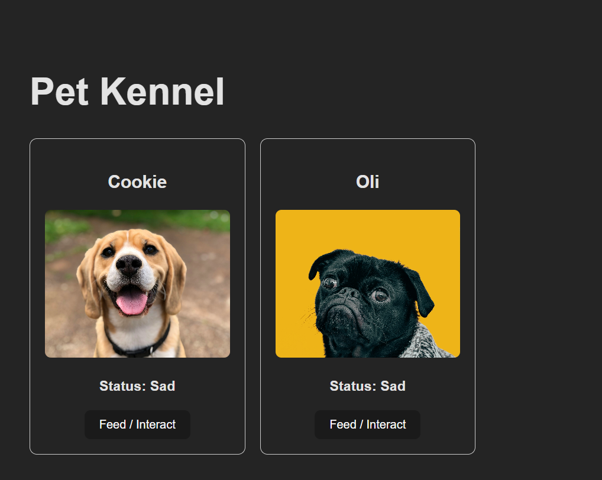

# Pet Kennel

Pet Kennel is a React application that displays multiple pets and allows the user to interact with them.

Each pet has a name, image, and happiness status. Clicking the **Feed / Interact** button changes the pet's status between Happy and Sad and updates the pet's image.

## Installation

1. Clone the repository:

```bash
git clone https://github.com/Rue-0/petKennel-DR.git
## Usage

The application displays multiple pet cards.

Each card includes:

- Pet name
- Pet image
- Happiness status
- Feed / Interact button

Clicking the **Feed / Interact** button changes that pet's happiness status and image.

The parent React class component manages the pet data in state. The pet information and callback function are passed to the child components using props.
## Screenshots



## Technologies Used

- React
- JavaScript
- JSX
- Vite
- HTML
- CSS
- Git
- GitHub
- GitHub Codespaces

## License

This project uses the MIT License.
